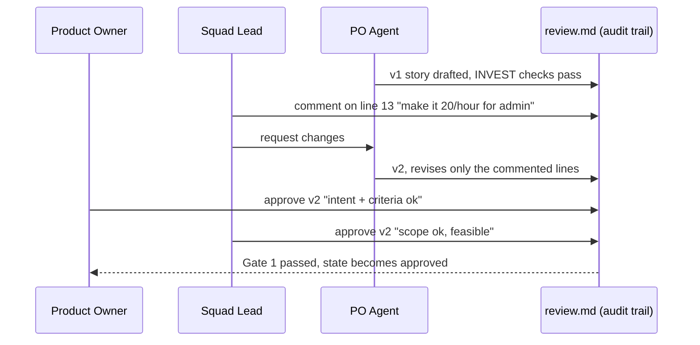
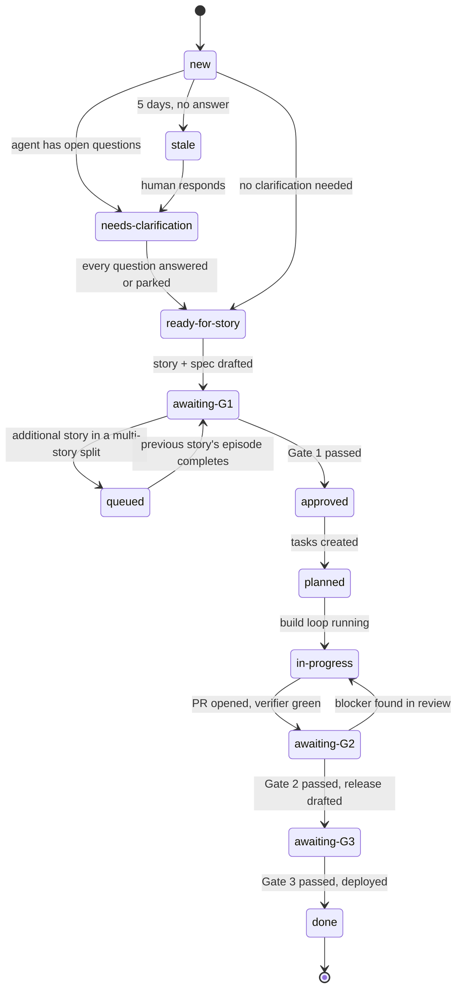
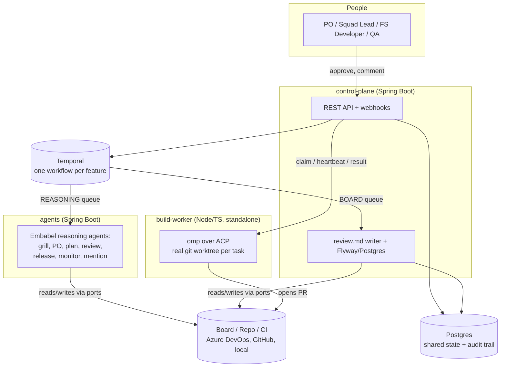

# AI PDLC — a proposal for a governed, agent-driven product development lifecycle

*Audience: sponsors, product leadership, engineering leadership. For the technical spec see
[`agent-playbook.md`](agent-playbook.md), [`orchestration-decision.md`](orchestration-decision.md),
and [`tech-stack-architecture.md`](tech-stack-architecture.md). For a live walkthrough, see the
`docs/presentation/` deck. This document is neither of those — it is the business case.*

---

## 1. The idea, in one sentence

**Route every feature through a fixed pipeline where AI agents do the repeatable analysis, writing,
and coding work, and named humans make exactly three decisions — approve the story, approve the
pull request, approve the release — with everything in between recorded, so nothing ships that a
human didn't sign off on and nothing gets lost between "we agreed to build this" and "it's live."**

This is not "let an AI write code and hope." It is a **workflow**, with agents as workers and
humans as checkers, built on the same governance pattern banks already use for every other
regulated process: **maker-checker**. The agent makes; a named human checks. Every time.

---

## 2. The problem this solves

Ask any engineering leader what actually slows a feature down, and it is rarely "the code is hard
to write." It is:

- **Unclear requirements that surface late.** A one-line card reaches a developer three sprints
  after intake, and the questions that should have been asked on day one — *which users, which
  data, what happens on the error path* — get asked in a PR review, or worse, in production.
- **Inconsistent governance.** Some teams have a rigorous design-review habit; others don't. When
  something goes wrong, "who approved this and on what version of the spec" is a Slack
  archaeology exercise, not a query.
- **Review is a bottleneck precisely because it's manual and repetitive.** A senior reviewer's time
  goes to restating what the tests already prove, not to the judgement calls only they can make.
- **The loop back from production to the backlog is manual and slow.** An incident becomes a
  postmortem becomes (eventually, maybe) a backlog card. Weeks pass. The team that shipped the bug
  has moved on.
- **AI coding assistants alone don't fix this.** A faster typist for unclear requirements just
  ships the wrong thing faster. The bottleneck was never typing speed.

**AI PDLC treats the whole delivery lifecycle — not just "write the code" — as the thing to
automate**, and keeps the three decisions that carry real accountability (*is this the right
thing to build, is this code safe to ship, is this release safe to release*) with named humans.

---

## 3. How it works end to end

One feature enters at the top, and the same wheel turns for every feature: seven AI agents do
analysis, writing, and build work; three gates are the only places a human has to act; a monitor
agent closes the loop by turning production evidence straight back into the next backlog item.

```mermaid
flowchart LR
    A["New idea filed on the board<br/>state: new"] --> B["Grill agent<br/>asks clarifying questions"]
    B -->|human answers/parks| B
    B --> C["PO agent<br/>drafts story + spec delta"]
    C --> G1{{"Gate 1<br/>PO + Squad Lead approve"}}
    G1 -->|changes requested| C
    G1 -->|approved| D["Plan agent<br/>splits into build tasks"]
    D --> E["Build loop<br/>agent writes code, runs tests"]
    E -->|verifier fails| E
    E -->|verifier green| F["Review agent<br/>first-pass PR review"]
    F --> G2{{"Gate 2<br/>FS Developer + QA approve"}}
    G2 -->|blocker found| E
    G2 -->|approved| H["Release agent<br/>drafts release pack"]
    H --> G3{{"Gate 3<br/>Squad Lead signs off"}}
    G3 -->|approved| I["Deploy"]
    I --> J["Monitor agent<br/>watches production"]
    J -->|rule trips| A

    classDef gate fill:#fde2e1,stroke:#d9381e,color:#7a1d10,font-weight:bold;
    classDef agent fill:#dbeafe,stroke:#0473ea,color:#020b43;
    class G1,G2,G3 gate;
    class B,C,D,E,F,H,J agent;
```

Read it left to right: **intake → clarify → write the story → Gate 1 → plan → build →
review → Gate 2 → release → Gate 3 → deploy → monitor → back to intake.** No step skips a gate;
no agent ever pushes work past one. That single design rule — *agents propose, humans dispose* —
is what makes this safe to point at production work rather than a demo.

---

## 4. The seven agents, in one table

Every agent is scoped narrowly, reads a fixed set of inputs, and hands off a typed result to
exactly one named human owner. None of them can act outside that scope.

| Agent | Turns | Into | Human owner | Never does |
|---|---|---|---|---|
| **Grill** | a one-line card | six categories of clarifying questions (scope, users/roles, acceptance, risk, dependency, NFR), each citing its evidence | PO answers; Squad Lead parks/escalates | answer its own questions |
| **PO** | answered questions | one story (plain English, for humans) **and** one spec delta (Given/When/Then, for the build loop) — same acceptance criteria, word for word | PO + Squad Lead — **Gate 1** | approve, or add scope nobody asked for |
| **Plan** | an approved story | dependency-ordered build tasks, each naming the one test that proves it | Squad Lead (adjusts; not a gate) | change a requirement |
| **Build** | one task | code + passing tests + a PR, inside a hard budget (iterations / tokens / wall-clock) | FS Developer | edit the verifier, disable a test, or touch files outside its task |
| **Review** | a green PR | a first-pass review — every finding tagged `blocker` / `should` / `nit`, with line-level traceability back to the spec | FS Developer + QA — **Gate 2** | approve or merge |
| **Release** | a merged story | the whole release pack — change notes, rollout plan, monitor rules, test evidence — each generated from a source of truth | named checker per document; Squad Lead — **Gate 3** | mark a document signed, or deploy before all four are signed |
| **Monitor** | a deployed release | evidence-backed bug cards the moment a rule trips, plus a weekly adoption note | PO triages | fix anything itself, flip a flag, or roll back |

*(An eighth, on-demand agent — Mention — lets any human reviewer summon a scoped analysis
mid-review by typing `@analyst`, `@architect`, or `@qa` on a comment. It is approval-gated the same
way, never automatic.)*

---

## 5. Governance: the same maker-checker pattern at every gate

This is not three different approval processes. It is **one pattern, three times**: an agent
drafts, a human comments, the agent revises *only what was commented on*, and two named humans
sign independently — on the exact version they read, proven by a content hash. Nothing crosses a
gate until both signatures land on the same version.

This is a worked, real example from the shipped pattern (`agent-playbook.md` — Maker-checker),
not a hypothetical. The same shape repeats at Gate 2 (FS Developer + QA on the PR) and Gate 3
(named checker per release document, Squad Lead on the whole pack). **A version bump clears
every earlier signature** — nobody is ever shown as having approved content they didn't actually
see.

Every comment, revision, and signature is written to two places that must agree: `review.md`
(a plain-text, git-committed audit trail next to the change itself) and an append-only Postgres
table. A feature can be replayed end to end afterward — *who asked for what, what the agent
changed, who signed which version, when.*

---

## 6. Work is always in exactly one state

Every card — feature, story, task, release — sits in exactly one of twelve wire-level states,
observed live from the actual system (not a status a person types into a field by hand):

For a leader, this replaces "what's my team working on?" (a status-meeting question) with a query
against a real field. `stale` exists specifically so nothing sits silently un-clarified for more
than five working days — it pages a human instead of aging quietly in a backlog.

---

## 7. Architecture at a glance

This is not a slideware concept — it is a running, five-component system today (Maven multi-module
+ a standalone Node build worker), built hexagonally so the board, the repo host, and the CI
system are all swappable via configuration rather than code changes.

**Why this design, in business terms:**

- **Durable, not fragile.** The workflow engine (Temporal) is what makes "wait for two named
  people to approve, possibly across several days" a reliable, resumable state rather than
  something that breaks if a server restarts. A gate can sit open over a weekend with zero risk of
  losing track of it.
- **Swap your tools without rewriting the system.** The board (Azure DevOps today; Jira/GitHub are
  the same pattern), the repo host, and the CI system are all behind an interface (`BoardPort`,
  `RepoPort`, `CiPort`). Onboarding a second squad on a different toolchain is a config profile in
  `pdlc.yaml`, not new code.
- **Reasoning work and coding work are separated on purpose.** The seven analysis/writing agents
  (grill, PO, plan, review, release, monitor) run on one queue; the actual code-writing loop runs
  on a completely separate queue with its own budget and its own sandboxed git worktree per task.
  A burst of build activity can never starve story approvals, and vice versa.
- **Cost is capped per role, not open-ended.** Every agent has a token budget (grill 60k · PO 40k
  · plan 80k · build 120k per task · review 60k · release 40k · monitor 30k per evaluation) set in
  configuration. A runaway agent cannot run up an unbounded bill.

---

## 8. Why this matters for the business

**It is demonstrably real, not a pitch deck.** The pilot ships runnable, assertion-bearing
end-to-end scripts (`scripts/e2e-demo.sh`, `-phase3.sh`, `-phase4.sh`) that exercise the full
webhook → grill → story → Gate 1 → plan → build → Gate 2 → release → Gate 3 → deploy → monitor
path against a real git repository, real tests, and a real Postgres-backed board API — the same
claims in this document, provable by running the scripts.

**Quality gates catch problems before a human ever sees them.** In one pilot run, a drafted story
scored 58 on the automated quality check, was automatically revised, and the second version scored
88 and passed — a bad first draft never reached a human reviewer's queue at all.

**The build loop is honest about its own limits.** In an 8-task pilot story, all 8 tasks finished
verifier-green in 24–36 iterations each, inside a 10-minute wall-clock budget per task. Just as
important: when a task *can't* finish, it stops cleanly — commits its work-in-progress, writes an
escalation note explaining what it tried, and hands the human a running start instead of a dead
end. **A budget stop is treated as a correct outcome, not a failure.**

**The loop closes itself.** A shipped release (`R-2026-09-02-4423` in the pilot run) was watched
by the monitor agent against its own declared thresholds; when an error-rate rule tripped
(observed 3.1% against a 2% threshold), the agent filed an evidence-backed bug card automatically
— titled with the rule that tripped, linked to the release — and the wheel simply turned again
through the grill agent. No war-room hand-off is required to get an incident back into a backlog.

**Reviewers spend their time on judgement, not on restating what a test already proves.** The
review agent produces line-by-line traceability from each acceptance scenario to the code and the
test that satisfies it, before a human ever opens the PR — the human's time goes to the two or
three findings that need real judgement.

**Every decision is provably attributable.** A signature is `{who, role, stage, version, content
hash, timestamp}`. Two independent, append-only trails (git-committed `review.md` next to the
change; Postgres `review_events`) must always agree, and a nightly check confirms they do. For any
audit — internal, regulatory, or post-incident — "who approved exactly what, and when" is a lookup,
not an investigation.

---

## 9. The guardrails — what keeps this safe to point at real work

| Guardrail | What it prevents |
|---|---|
| **No agent ever crosses a gate.** Every agent sets `awaiting-G<n>` and stops; only a signal from a named, authenticated human moves state past a gate. | An agent quietly shipping its own work |
| **Separation of duties.** The account that ran the maker on a stage can never be the checker on that same stage. | Self-approval |
| **Signatures are per version.** Any comment that changes the artifact clears every earlier signature. | Someone being shown as approving content they never actually saw |
| **The build agent cannot edit the verifier, edit tests outside the one file its task names, touch the spec, merge, or push to main.** A shared test file's prior content must survive **byte-for-byte**. | An agent quietly weakening a test to fake a green result |
| **Every write carries an idempotency key.** | Retries (which *will* happen) duplicating board cards or corrupting state |
| **Budgets are enforced per agent and per task**, hard-capped at the model gateway. | Runaway spend from a stuck or looping agent |
| **The verifier is deterministic-first and owned by QA, not by the agent that writes the code.** Only QA can make it *stricter* without going through the story process. | An agent grading its own homework |

---

## 10. What one live pilot run already taught us

None of this is theoretical risk-listing — a real pilot run surfaced four concrete failures, and
each is now a structural fix, not a note in a runbook:

| What happened | Root cause | The fix |
|---|---|---|
| A build once landed in the wrong file | The model occasionally forgot to emit a required `Area:` marker | Stopped relying on the model to remember it — the marker is now injected deterministically |
| Board cards were duplicated | At-least-once delivery redelivered the same event | `createItem` now dedupes on an idempotency key |
| New stories silently rebound to old row ids | An id sequence wasn't persisted across a Postgres restart | State that outlives a process now lives in the database, not in memory |
| Task cards sat in `new` forever | Verifier outcomes weren't being synced back onto the board | The board is now updated with the real verifier result, every time |

**The through-line is one word: idempotency.** Retries will happen in any real system; the fix in
every case was making the write safe to repeat, not adding another special case. This is why the
pilot's own design rules (below) exist as rules, not aspirations.

**Eight design rules, distilled from building this:**

1. Start with one workflow, prove it end to end, before scaling to a platform.
2. Push every deterministic decision into code — no model call where a function suffices.
3. Reserve agents for the reasoning that genuinely needs judgement.
4. Make context (specs, state, evidence) travel with the work, not live in someone's head.
5. Isolate parallel work — an inner loop never touches shared board state directly.
6. Give every piece of work exactly one canonical, machine-readable state.
7. Build recovery in from day one: idempotent writes, durable state, not "we'll add retries later."
8. Measure the factory's throughput and quality — not one model's output in isolation.

---

## 11. What adopting this needs from your team

This is designed to layer onto tools you already run, not replace them:

1. **A board** — Azure DevOps is wired up today; Jira/GitHub Issues follow the same adapter
   pattern (`BoardPort`).
2. **A repo host** — GitHub is wired up today; the same pattern extends to Azure Repos/GitLab.
3. **A CI system** that can run your own test suite as the read-only verifier — the agents never
   get write access to it.
4. **One `pdlc.yaml` profile per squad** — board/repo/CI provider, model routing per agent role,
   and who sits at each gate. Two squads on different toolchains run off two profiles of the same
   system.
5. **Named humans at each gate** — this only works with real accountable owners at G1 (PO + Squad
   Lead), G2 (FS Developer + QA), and G3 (Squad Lead) — the system enforces the pattern, it doesn't
   invent the people.

**Suggested rollout, smallest first:** one squad, one profile, Gate 1 only (intake → clarify →
story → approval) — prove the governance pattern on the cheapest, fastest part of the pipeline —
then add the build loop and Gate 2, then release/Gate 3/monitor. Each stage is independently
useful; none requires the next to already exist.

---

## 12. Glossary

| Term | Meaning |
|---|---|
| **Gate** | A point where an agent stops and named humans must approve before work continues. There are exactly three: G1 (story), G2 (PR), G3 (release). |
| **Maker-checker** | The governance pattern: one party (the agent) drafts, a different, named party (a human) checks and signs. Universal across all three gates. |
| **Spec delta** | The precise, testable requirements an agent builds against (Given/When/Then scenarios) — the machine-readable twin of the human-readable story. |
| **Verifier** | The one, deterministic definition of "done" for a build task — owned by QA, never editable by the agent being graded against it. |
| **Handoff envelope** | The small, typed block every agent output starts with, so the next agent (or human) parses state, not prose. |
| **review.md** | The append-only, git-committed audit trail for one change — every comment, revision, and signature, replayable later. |
| **Canonical state** | The one machine-readable status field a card is always in (twelve possible values — see §6) — independent of what your board vendor happens to call it. |

---

## 13. Where to go deeper

- **Per-agent detail** (exact reads/does/validates/stop-rules for all eight agents): `agent-playbook.md`
- **Why this architecture, not alternatives** (workflow engine vs. pollers, Embabel vs. goose,
  scaling design): `orchestration-decision.md`
- **Full technology stack, data model, and configuration reference**: `tech-stack-architecture.md`
- **A live, narrated walkthrough of the same idea** (21 lessons, one growing diagram): `docs/presentation/`
- **Runnable proof, not slides**: `scripts/e2e-demo.sh`, `scripts/e2e-demo-phase3.sh`, `scripts/e2e-demo-phase4.sh`
