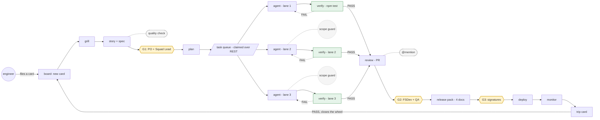

# AI PDLC — Loops, Workflows, and the Software Factory

Full slide content of the 90-minute interactive deck at `docs/presentation/` (`index.html` +
`deck.js` + `slides/part1.js`…`part6.js`). 23 slides — a title, a map, and 21 numbered lessons —
built around one shared, progressively-growing loop diagram. Each lesson below includes its
speaker notes (`data-notes`) as a blockquote.

Total runtime: 90 min. If running long, cut Lesson 3 or Lesson 10 — never Lesson 13, 17, or 19
(load-bearing: parallelization, the full flow, and what a live run taught us).

---

## Title

# AI PDLC — Loops, Workflows, and the Software Factory

> We have ninety minutes. One diagram grows from two boxes into a full factory. Do not try to
> hold the whole machine in your head now. We build it piece by piece, and every piece answers
> the same question: where does the human decision sit?

---

## Map

## Twenty-one lessons. One growing diagram.

21 atomic lessons. One diagram that grows. If we run long we cut Lesson 3 or Lesson 10 — never
Lesson 13, Lesson 17, or Lesson 19.

> This is the shape of the next ninety minutes. Twenty-one atomic lessons, one diagram that
> grows. Each lesson is one idea and one punchline. If we run long we cut L3 or L10, never L13,
> L17, or L19. Those are the load-bearing lessons: parallelization, the full flow, and what a
> live run taught us.

---

## Lesson 1 · 4 min — The opening provocation

**The old model**
1. Prompt — you type a request.
2. Agent — the model does the work.
3. Loop — it iterates until something passes.

> The loop runs. But the loop is not the product.

In 90 minutes, the finished machine exists — built two boxes at a time.

**Punchline:** The loop is not the product. The product is the workflow.

> Start with the provocation. The loop is not the product. The old mental model was a chain:
> prompt, then agent, then loop. But the loop was never the deliverable. The workflow around it
> was. In ninety minutes we build a machine two boxes at a time, and the finished thing is
> already here as a silhouette.

---

## Lesson 2 · 4 min — Where we started

| Era | Closed the distance from → to |
|---|---|
| **Waterfall** | intent → a signed plan |
| **Agile** | plan → a shippable slice |
| **CI/CD** | change → production |
| **Cloud/DevOps** | hardware → configuration |
| **AI-assisted** | words → a first draft |

**Punchline:** Every era shortened the distance between intent and running code. None removed
the human decision.

> Before the loop, walk the eras. Each one shortened the distance between intent and running
> code. Waterfall closed intent to a plan. Agile closed plan to a shippable slice. CI/CD closed
> change to production. Cloud closed hardware to configuration. AI-assisted closes words to a
> first draft. Every era removed friction, and none of them removed the human decision.

---

## Lesson 3 · 4 min — Who writes the prompt

The ladder, bottom to top:
1. **vibe coding** — the human types whatever comes to mind.
2. **prompt engineering** — the human writes a structured prompt with examples.
3. **context engineering** — the human hands the model the files it needs.
4. **spec-driven development** — the spec is the prompt.
5. **harness-driven** — the harness drives the agent and verifies the result.
6. **loop-driven** — the loop feeds results back in and decides.
7. **AI PDLC** — the whole machine writes the prompt; the human writes the workflow.

**Punchline:** What changed is who writes the prompt.

> The question used to be: can it code. The real question is: who writes the prompt. Walk the
> ladder. First the human wrote freely. Then the human wrote structured prompts. Then the human
> handed over context. Then the spec wrote the prompt, then the harness, then the loop. At the
> top of the ladder the whole machine writes the prompt, and the human writes the workflow.

---

## Lesson 4 · 5 min — The three actors

| Actor | Best at | Examples |
|---|---|---|
| **Code** | Deterministic. Same input, same output, every time. | Run the tests, parse the results, check exit codes, create worktrees |
| **Engineers** | Judgment. The decisions that need a human name on them. | What should be built, what matters, is it correct, what tradeoffs |
| **Agents** | Flexible reasoning. Strong in the fuzzy middle. | Interpretation, exploration, implementation, debugging, planning, adapting |

**Punchline:** Use code where determinism is enough. Use agents where reasoning is required.
Keep engineers where judgment matters.

> Three kinds of actors build everything in this deck: code, engineers, and agents. Code is
> deterministic — run the tests, parse the results, check the exit code, create the worktree.
> Engineers carry judgment — what to build, what matters, whether it is correct, what tradeoffs
> to accept. Agents are flexible reasoners — interpretation, exploration, implementation,
> debugging, planning, adapting. The whole machine is just these three actors arranged into
> loops. The art is putting each one where it is strongest.

---

## Lesson 5 · 4 min — SDD — the spec is the prompt

**Story card:**
> "As a user, I want to export my results."

An opinion — nothing a machine can verify.

The same intent, exploded into a spec delta — three files:
- `openspec/changes/<slug>/proposal.md`
- `specs/<area>/spec.md`
- `tasks.md`

**Real run — the spec becomes the test.** Gherkin `Scenario:` names become the verifier's test
names:
```
scenario: export-button-available-with-active-filters
```

**Punchline:** A story card is an opinion. A spec delta is a contract.

> SDD means the spec is the prompt. A story card is a sentence; a spec delta is a directory of
> decisions. proposal.md says what changes and why; specs/area/spec.md says exactly what the new
> behavior is; tasks.md breaks it into verifiable steps. Gherkin Scenario names become the
> verifier's test names — one real scenario was export-button-available-with-active-filters. The
> agent builds to the contract, not to the opinion.

---

## Lesson 6 · 5 min — The simplest loop — stages 1 & 2

*(Loop diagram: stage 2 — engineer → agent → verify → review, with a fail path back into the
agent.)*

The agent writes code. Deterministic verify runs the repo's own tests. PASS → review. FAIL →
back into the same agent session, the failure becomes the next prompt.

**Punchline:** Agents plus code beat agents alone.

> This is where the loop appears for the first time. Stage one is the smallest useful workflow:
> an engineer drives an agent, and the agent's work goes to review. Stage two adds one
> deterministic box — verify, running the repo's own npm test. If verify passes, the diff goes to
> review. If it fails, the failure loops back into the same agent session as new context. Agents
> plus code beat agents alone, because code gives the agent a ground truth to retry against.

---

## Lesson 7 · 4 min — omp + Orca — the coding agent

**omp — the agent**
- **LSP / DAP** — real code + debugger context, not grep
- **hashline edits** — deterministic, reviewable file changes
- **sessions** — a long-lived loop you can keep driving
- **subagents** — parallel work, isolated in their own worktrees
- `omp --mode acp` — the same session, driven by protocol

Decision record: omp chosen for LSP/DAP/hashline, ACP + RPC + SDK surfaces, subagents in
worktrees.

**Orca — the terminal.** The terminal the engineer drives omp from.

**Punchline:** The coding agent is a session you can drive — by hand from a terminal, or by
protocol from a machine.

> Two tools sit in the coding loop: omp is the agent, Orca is where you stand. omp does the
> deterministic work — LSP and DAP context, hashline-precise edits, a session you can keep open,
> subagents spun up in their own worktrees. It also exposes an ACP mode, so a machine can drive
> that same session over a protocol instead of a keyboard. Orca is simply the terminal the
> engineer drives omp from. Same agent, same session — driven by hand or by protocol.

---

## Lesson 8 · 4 min — ACP — the wire between them

**Handshake:** client (**build worker** — opens the session, sends the prompt, enforces scope +
budget) ⇄ prompt/tool-calls/results ⇄ agent (**`omp --mode acp`** — the session being driven,
over stdio or HTTP/WS).

| Client | Agent | Transport |
|---|---|---|
| build worker | `omp --mode acp` | stdio (container exec) |
| goose desktop | `omp` | stdio |
| editor (Zed / JetBrains) | `omp` / `goose` | stdio |
| Embabel / workflow | `goose serve` | ACP over HTTP/WS |

Embabel reasoning agents are reached over MCP, never ACP — ACP drives a *session-based* agent,
and they are not one.

**Punchline:** ACP is for driving a session-based agent. If there's no session, it's the wrong
wire.

> ACP is the wire that connects a client to a session-based agent. The client opens a session,
> sends prompts, and receives tool calls and results back over one of two transports — stdio
> inside a sandbox, or HTTP/WS to a long-running service. The build worker talks to omp this way.
> So does the FS Developer's desktop, and so does an editor. But Embabel's reasoning agents are
> not sessions, so they are reached over MCP instead — ACP is the wrong wire for them.

---

## Lesson 9 · 4 min — Embabel — typed reasoning

- Inject `Ai` bean — one interface, no per-agent plumbing.
- Per-role model routing — `agents.roles.<role>.model` in `pdlc.yaml`.
- Typed handoffs — `PoHandoff` / `PlanHandoff`-style envelopes, not prose.
- INVEST checks as `@Condition`s — the planner can't publish until they hold.
- GOAP replanning — new checker comments are new world state; the plan replans. No new prompt
  engineering.

Every box added to the top row of the canvas will be one of these.

**Punchline:** Free-text output is a prototype. A typed contract is a system.

> Every reasoning agent in the top row — grill, PO, plan, review, release, monitor — runs on
> Embabel. It gives each agent an injectable Ai bean and routes it to a per-role model straight
> out of the config. Handoffs between agents are typed records, not free text. The INVEST and
> definition-of-ready checks are conditions the planner must satisfy before it reaches its goal.
> When a checker adds a comment, that is a new world state and the planner replans — no new
> prompt engineering.

---

## Lesson 10 · 3 min — Temporal — the durable outer loop

```
grill → story + spec → [G1 · wait on humans] → plan → [build · heartbeats] → review
      → [G2 · wait on humans] → release → [G3 · wait on humans] → deploy → monitor
```

Task queues:
- **REASONING** — Embabel agents
- **BOARD** — control-plane side effects
- **BUILD** — build worker (spawns omp)

Queue split: one worker per queue avoids cross-activity-set "not registered" errors — and the
exponential-backoff retry lottery that comes with them.

Riding under it: Postgres · Temporal UI · WireMock stub-llm · docker-compose.

Temporal is the table the whole canvas sits on.

**Punchline:** Waiting for humans across days, exactly-once progression, auditability — the
engine's native features, not code you maintain.

> Temporal is the durable outer loop that holds each piece of work from intake to done. The
> workflow calls the reasoning agents, then waits at a gate — sometimes for days — until the
> right humans sign. Meanwhile the build loop runs inside a long activity with heartbeats. The
> queues are split for a real reason: two workers on one queue each hold half the activities, and
> Temporal dispatches to whichever one is polling, so the wrong worker rejects the task and
> retries with exponential backoff. Splitting the queue makes each worker the only poller for its
> own activities. Postgres, the Temporal UI, and a WireMock stub LLM all ride under it.

---

## Lesson 11 · 5 min — Stage 3 — put a spec in front

The engineer used to type a prompt straight into the agent. **That edge retires here.**

> **A card, not a prompt.** The engineer files a card on the board. The loop now eats a spec
> delta — **the spec is the prompt**.

**Grill agent — six categories, every question cited:** scope · users / roles · acceptance ·
risk · dependency · NFR

Each question cites the evidence that prompted it — a file, a spec line, an incident — or is
marked `assumption-check`. It must never ask what the description already says.

**PO agent — one story, written twice:**

| Spec delta *(what agents build from)* | Story *(what humans approve)* |
|---|---|
| `ADDED` / `MODIFIED` / `REMOVED` sections | Same acceptance criteria, word for word |
| Gherkin `Scenario:` — GIVEN / WHEN / THEN | Parked questions become out-of-scope lines |
| MUST / SHALL / SHOULD / MAY requirements | Every risk answer becomes a scenario or NFR |

**Punchline:** Nothing becomes a story until every question is answered or parked.

> The engineer used to type a prompt straight into the agent — that raw edge retires here.
> Instead, a card is filed on the board, and the grill agent interrogates it across six fixed
> categories: scope, users and roles, acceptance, risk, dependency, and NFR. Every question must
> cite the evidence that prompted it — a file, a spec line, an incident — or be marked
> assumption-check, and it must never ask what the description already says. When every question
> is answered or parked, the PO agent writes the story twice: a Gherkin spec delta with ADDED,
> MODIFIED, and REMOVED sections, and a human-readable story that mirrors it word for word. That
> delta — not a prompt — is what feeds the agent.

---

## Lesson 12 · 5 min — Stage 4 — add the human gate

The story is written — but **no agent crosses a gate**. It sets the state to `awaiting-G1` and
stops.

**G1 — two named humans, approving independently:**
- **PO** — approves intent + acceptance criteria
- **Squad Lead** — approves scope, feasibility, risk

Either can send it back with a comment — the PO agent re-runs with that comment as new input.

**Maker-checker — the pattern is identical at every gate:**
- A preview surface with line-level comments
- A `blocking` comment freezes the gate for everyone
- Signatures are **per version** — a new version clears all earlier approvals

> **Live run — story 9004.** Quality v1 scored **58** → failed. Auto-revise → v2 scored **88** →
> passed.

**Punchline:** Maker-checker: the agent makes; named humans check — per version, with blocking
comments.

> Stage 4 adds the first human gate. The PO agent has written the story, but no agent crosses a
> gate — it sets the state to awaiting-G1 and stops. G1 is two named humans, the PO and the Squad
> Lead, who approve independently: the PO owns intent and acceptance criteria, the Squad Lead
> owns scope, feasibility, and risk. The maker-checker pattern is identical at every gate — a
> preview surface with line-level comments, where a blocking comment disables the approve buttons
> for everyone. Approvals are per version, so a new version clears every earlier signature. In
> the live run, story 9004's quality check failed at 58, auto-revised, and passed at 88.

---

## Lesson 13 · 5 min — Stage 5 — split, isolate, parallelize

One lane became three. The plan agent splits the approved story into tasks — **one code area,
one scenario, one proof per task**.

**Isolation — a lane never touches board state:**
- Build workers **claim** tasks over REST — `POST /api/build-tasks/claim`
- **One git worktree per task** — no shared working copy
- The verifier is the repo's own `npm test`, TAP-parsed

**The scope guard:**
- Any file changed outside the task's `touches` list is reverted — `revertPaths`
- A shared test file's prior content must survive **byte-for-byte** — `wasTestContentPreserved`
- An agent can never weaken another task's test to make its own pass

> **Live run.** 8 / 8 tasks verifier-green · 24–36 iterations · `PT10M` wall-clock budget per
> task.

**Punchline:** An inner loop never touches board state. It returns a typed result and the outer
loop decides.

> Stage 5 splits one loop into three isolated lanes. The plan agent breaks the approved story
> into tasks in dependency order — one code area, one scenario, one proof per task — and writes
> them to a queue. Build workers claim tasks over REST at /api/build-tasks/claim, each in its own
> git worktree, so lanes never touch each other. The verifier is not an LLM — it runs the target
> repo's own npm test and parses the TAP output, green only if every named top-level test passes.
> A scope guard reverts any file changed outside the task's touches list, and a shared test
> file's prior content must survive byte-for-byte. In the live run, all 8 tasks went
> verifier-green across 24 to 36 iterations, each inside a PT10M wall-clock budget.

---

## Lesson 14 · 4 min — Stage 6 — review, and the second gate

The review agent is the first reviewer on every PR — findings tagged `blocker`, `should`, or
`nit`. Only a `blocker` requests changes.

> **A blocker loops back.** It returns to the build loop with the finding as the new first line
> of context — never an approval.

**G2 — the second human gate.** **FS Developer + QA** own the review output. They read the
review agent's traceability rows, then judge.

**Any reviewer can summon an agent with an @:**
```
@d → @dev — implementation & code questions, reads the repo
draft: pending → human approves → appended to review.md
```
Fixed pilot set: `@analyst`, `@architect`, `@qa`, `@dev`. First mention wins.

**Punchline:** Every agent has a human who owns its output — and any reviewer can summon an
agent with an @.

> After the lanes finish, the review agent is the first reviewer on every PR. Its findings are
> tagged blocker, should, or nit — and only a blocker requests changes. A blocker from the review
> agent sends the task back to the build loop with that finding as its new first line of context.
> Then the second human gate opens: G2, the FS Developer and QA, who own the review output. Any
> reviewer can also summon an agent in a comment by mentioning it. The fixed pilot set is four
> agents — analyst, architect, qa, and dev — and the first mention in a comment wins.

---

## Lesson 15 · 4 min — Stage 7 — release, the third gate, deploy

A merged story becomes a release. The release agent drafts the whole pack — **it drafts, it
never signs**.

**Release pack — four documents, four checkers:**
- `change-notes` · PO
- `rollout-plan` · Squad Lead
- `monitor-rules` · QA
- `test-evidence` · QA

Each is generated from a source of truth and assigned a named human checker.

**G3 — the third gate.** Opens only when **all four documents are signed**. A
`changes-requested` bumps the pack version and clears every older signature.

> **Live deploy marker.** `R-2026-09-02-4423` — released, signed, shipped.

**Punchline:** Agents draft every document. Named humans sign each one.

> Stage 7 turns a merged story into a release the Squad Lead can approve on one screen. The
> release agent drafts every document in the pack — change notes, rollout plan, monitor rules,
> and test evidence — each generated from a source of truth and assigned a named human checker.
> The third gate, G3, opens only when all four documents are signed. The agent drafts and
> re-drafts, but it never signs; a changes-requested on any document bumps the pack version and
> clears every older signature. The live deploy marker is R-2026-09-02-4423.

---

## Lesson 16 · 4 min — Stage 8 — monitor closes the wheel

Deploy is not done. The monitor agent keeps watching for the release's whole watch window.

**A tripped rule becomes evidence on the board:**
- Evaluates each rule on its window against a 7-day baseline
- On a trip: gathers the numbers, the window, sample traces
- Files a **bug card in state `new`** — which the grill agent picks up

> **Live trip.** Rule `export-error-rate` — `http_5xx_rate > 2% over PT15M` — observed **3.1%**.
> Filed card: **Monitor trip: export-error-rate**.

**The wheel closes.** deploy → monitor → board → grill → … a filed card sends the loop back
through the top.

**Punchline:** Deploy is not done. The monitor files evidence back to the board, and the wheel
closes.

> Stage 8 closes the wheel. Deploy is not the end — the monitor agent keeps watching for the
> release's watch window, evaluating each monitor rule on its window against a seven-day
> baseline. When a rule trips, it gathers evidence and files a bug card on the board with the
> tripped rule id in the title, in state new. That state new card is picked up by the grill
> agent, and the wheel turns again. The live run tripped export-error-rate — HTTP 5xx rate over 2
> percent for 15 minutes, observed at 3.1 percent — and filed a card titled Monitor trip:
> export-error-rate. That is the whole machine: deploy feeds monitor, monitor feeds the board,
> the board feeds the grill.

---

## Lesson 17 · 8 min — THE FLOW — run the machine

*Press play — the token runs the whole circuit once, including one scripted failure and retry.*
Controls: Play / Pause / Reset, speed 1x / 2x (dwell per node drops from 700ms to 350ms at 2x).



*Solid arrows are the happy path; dashed arrows are FAIL loop-backs (verifier red → same agent
lane) and side annotations (quality check, scope guard, @mention). The `trip → board` edge is
the one that closes the wheel: a monitor trip files a new card back where the engineer's original
card started.*

The card starts at the board, gets grilled into a story plus spec, and clears G1 into the plan
and queue. The token enters an agent lane, fails the verifier once, loops back, then passes and
flows review, G2, release, G3, deploy, monitor, and a trip card that closes the wheel back at the
board.

**Punchline:** The loop is only one mechanism inside the machine.

> This is the centerpiece: the finished stage-8 machine running end to end, one token. Watch the
> wheel turn once. The card starts at the board, gets grilled into a story plus spec, and clears
> G1 into the plan and queue. The token enters an agent lane, fails the verifier once, loops
> back, then passes and flows review, G2, release, G3, deploy, monitor, and a trip card that
> closes the wheel back at the board. Press play; pause and reset are there so you can freeze and
> re-walk any leg. At 2x the dwell per node drops from 700ms to 350ms. The loop is only one
> mechanism inside the machine.

---

## Lesson 18 · 3 min — The kanban view — work as state

The board is the source of truth. Each card sits in exactly one canonical state — these are the
live wire values.

**Main line:**
```
new → needs-clarification → ready-for-story → awaiting-G1 → approved → planned
    → in-progress → awaiting-G2 → approved → awaiting-G3 → done
```

**Parked, off the main line:** `queued` · `stale`

↵ verifier red loops back to `in-progress`

**Punchline:** Stop asking what your agent is doing. Ask what state each piece of work is in.

> Every piece of work in this pipeline is a card, and every card sits in exactly one canonical
> state. Those states are wire values, observed live on the board API, not a presentation
> metaphor. Light them in order and watch work move from new to done through two approval gates.
> Two states live off the main line: queued, parked awaiting a worker, and stale, parked awaiting
> clarification for five days. When the verifier goes red, the card loops back to in-progress and
> the lane tries again. Stop asking what your agent is doing; ask what state the work is in.

---

## Lesson 19 · 3 min — What a live run taught us

The failures are not interesting because they happened. They are interesting because each one is
now *structural* — engineered out of the path, not left to luck.

- **LLM output varies.** A missing `Area:` marker sent a build to the wrong file. Fixed by
  deterministic injection — never bet the build on the model remembering to emit it.
- **At-least-once delivery.** Delivery duplicated every board card until `createItem` deduped on
  an idempotency key. The write became safe to repeat.
- **An id sequence that forgot to persist.** Across Postgres restarts, new stories silently
  rebound to old row ids. State that outlives a process belongs in the database.
- **Cards stuck in "new".** Task cards sat in `new` forever until real verifier outcomes were
  synced back onto the board. The board reflects work, not wishes.

**Punchline:** Agents plus code beat agents alone — and code plus retries demands idempotency.

> Four real failures from one live run — all fixed in the repo, all now invisible because the
> factory absorbs them. First: a model sometimes forgot the Area: marker, and once sent a build
> to the wrong file; we stopped asking the model to remember and injected it deterministically.
> Second: at-least-once delivery duplicated board cards until createItem deduped on an
> idempotency key. Third: an id sequence that was not persisted across Postgres restarts silently
> rebound new stories to old rows. Fourth: task cards stayed stuck in new until verifier outcomes
> were synced back to the board. The through-line is one word — idempotency; retries will happen,
> so every write must be safe to repeat.

---

## Lesson 20 · 3 min — Eight design rules

Read them as a checklist, not a manifesto. Each one removes a whole class of the failures from
the last lesson.

1. **One workflow first** — pick one repeatable flow; automate it end to end before scaling out.
2. **Deterministic work in code** — tests, guards, parsing — no model where a function is enough.
3. **Agents for reasoning** — the ambiguous parts, reached over the right wire.
4. **Context portable** — specs, state, and evidence travel with the work.
5. **Isolate parallel work** — an inner loop never touches board state.
6. **Make state visible** — every piece of work has one canonical state.
7. **Build recovery in** — retries, idempotency, and durable state from day one.
8. **Measure the factory, not the agent** — track the workflow's throughput, not one model's
   output.

**Punchline:** Don't build the factory before you know which workflow you're automating.

> Eight rules, distilled from building this machine. Start with one workflow, not a platform.
> Push deterministic work into code; save agents for the reasoning that genuinely needs them.
> Make context portable, isolate parallel work so no inner loop touches board state, and make
> state visible as a single canonical field. Build recovery in from day one — idempotent writes,
> durable state. And measure the factory, not the agent: throughput and quality, not one model's
> output.

---

## Lesson 21 · 2 min — Final takeaway

Two ways to read the same climb:

**The maturity curve**
1. manual development
2. agent-assisted development
3. engineered developer workflows
4. software factory

**The work, re-framed**
1. write code
2. direct agents
3. design workflows
4. design the factory
5. improve the factory

**Punchline:** Don't ask "how do I build an agent loop?" Ask "what repeatable developer workflow
can I turn into a reliable system of code, agents, and human judgment?"

> We started with two boxes — an engineer and an agent — and grew it into a machine with three
> gates, three parallel lanes, and a monitor that closes the wheel. But the question was never
> how do I build an agent loop. The practical question is: what repeatable developer workflow can
> I turn into a reliable system of code, agents, and human judgment? Start with the workflow you
> already do by hand, every week. That — not a loop — is the thing to automate.
</content>
